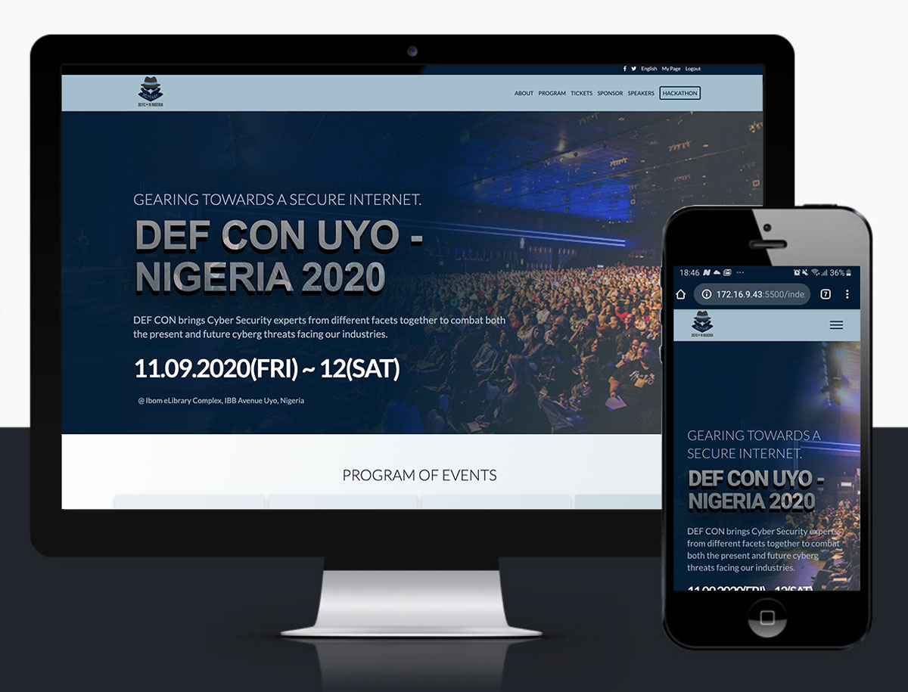

# DEF CON Uyo - Nigeria Conference Page

[](https://app.netlify.com/sites/defconuyo/deploys)

This project is a complete design on the DEF CON Uyo Conference page (Fictional). A design prototype from Cindy Shin [CC Global Summit 2015](https://www.behance.net/gallery/29845175/CC-Global-Summit-2015).

Complete design of the index, about and ticket page designed using Grid, Flexbox, and Position alongside with other CSS concepts.

In this project, SASS was utilized in compiling the style.css file.

The whole idea of modularizing the styles was indeed a great take away in this project. Thanks to SASS.

I used the CSS checkbox trick to implement the mobile menu.

I have also included the manifest.json file for the web, which holds some metadata for the site info and tells the browser more information about the application. You can easily generate on [here](https://tomitm.github.io/appmanifest/)



## Built With

- HTML
- CSS
- Stickler for CSS validation
- FontAwesome
- SASS
- Manifest

## Live Demo

[Live Demo Link](https://defconuyo.netlify.app/)

## Getting Started

To get a local copy of the repository please run the following commands on your terminal:

```
$ cd <folder>
```

```
$ git clone https://github.com/acushlakoncept/conference-page.git
```

To install the required sass node modules

```
$ npm install

```

Run SASS on command line to automatically compile to style.css

```
$ npm run compile:sass

```

## Future Implementations

> Adding backend

## Authors

**Uduak Essien**

- Github: [@acushlakoncept](https://github.com/acushlakoncept/)
- Twitter: [@acushlakoncept](https://twitter.com/acushlakoncept)
- Linkedin: [acushlakoncept](https://www.linkedin.com/in/acushlakoncept/)

## 🤝 Contributing

Contributions, issues and feature requests are welcome!

Feel free to check the [issues page](https://github.com/acushlakoncept/conference-page/issues).

## Show your support

Give a ⭐️ if you like this project!

## Acknowledgments

- UI Design Credits goes to [Cindy Shin - CC Global Summit 2015](https://www.behance.net/gallery/29845175/CC-Global-Summit-2015)
- Project inspired by Microverse Program
